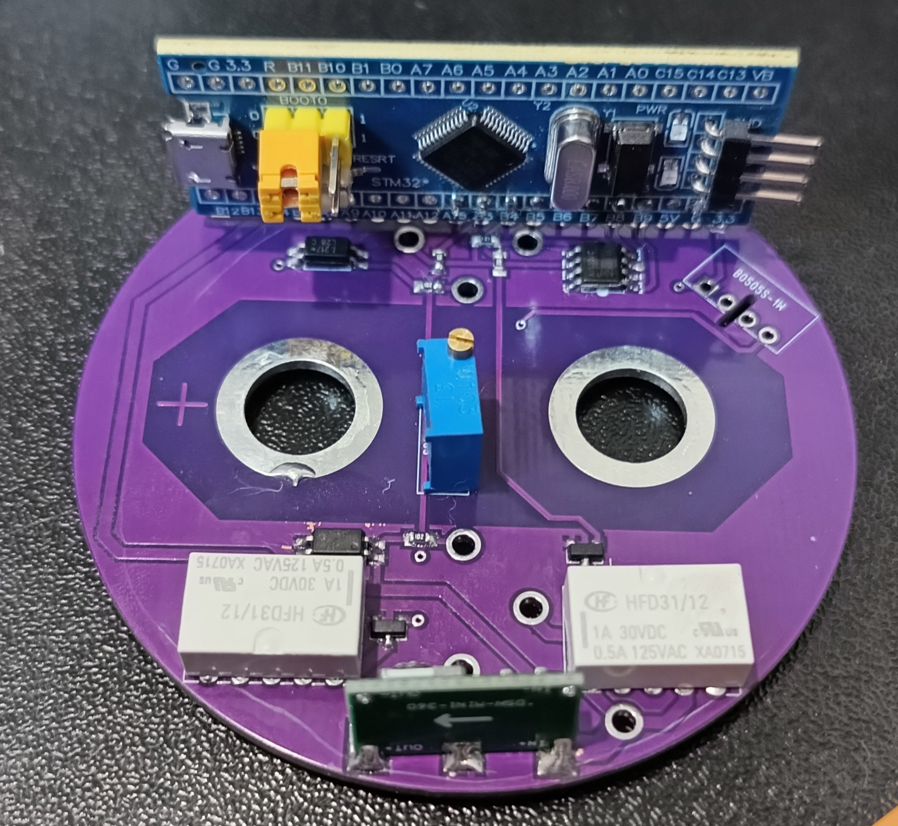
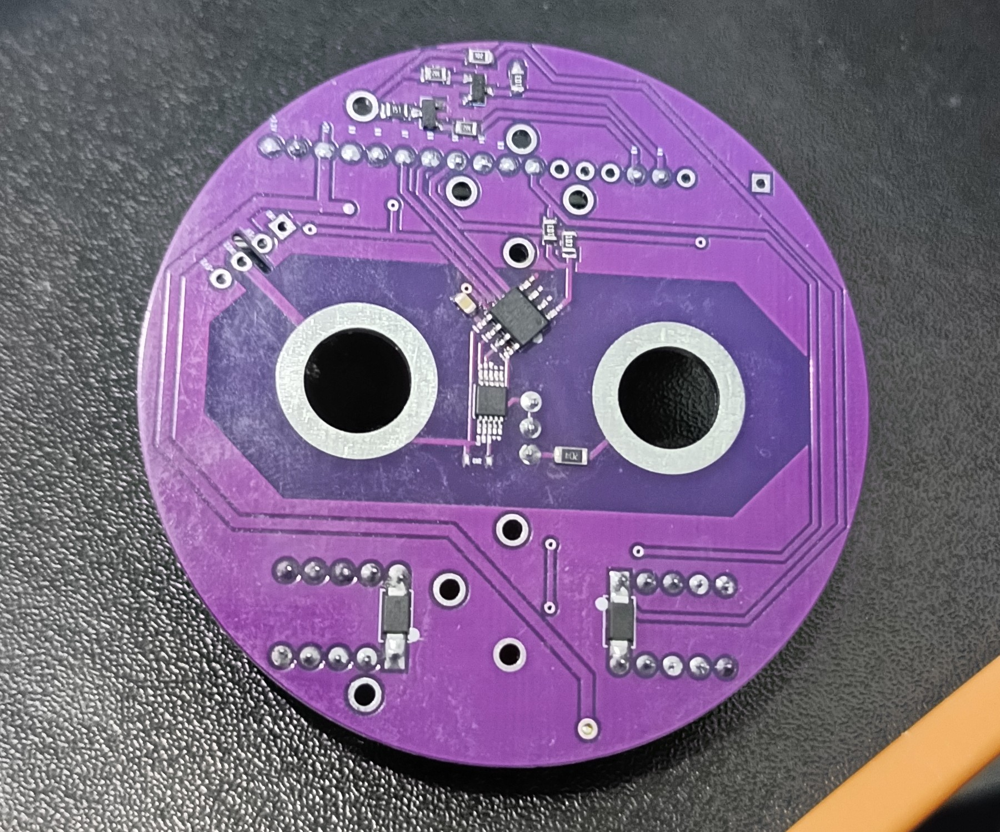

# CHAdeMO

> [!IMPORTANT]
> This implementation utilizes the CHAdeMO protocol, which is subject to
> Patents (SEPs) and Trade Secrets held by the CHAdeMO Association.
> **Users intending to manufacture or commercially distribute hardware
> derived from this software must secure the necessary licenses and
> permissions from the CHAdeMO Association.**
> The author claims no ownership over these third-party intellectual
> property rights and provides this code without warranty against
> third-party infringement.

> [!CAUTION]
> The author is not responsible for any damages done.
> This software is NOT considered safety critical,
> nor the author is competent enough to design such software. You have been warned!

This page is available in [DOXYGEN](https://furdog.github.io/chademo/) format
### WIP
The project is under early development

## Current status
- CHAdeMO power supply equipment (SE) Logic (Hardware-Agnostic) - Under active development
- CHAdeMO power supply equipment (EV) Logic (Hardware-Agnostic) - Not yet available
- IEEE Std 2030.1.1™-2015 Requirement Traceability Matrix  (RTM) - Under active development

## Project overview
> [!NOTE]
> Implemented based on the technical specifications outlined in
> IEEE Std 2030.1.1™-2015. The specification is not included in this
> repository due to legal reasons. The standard might be changed
> (to newer version) any time soon.

This repository contains the software implementation of the CHAdeMO charger (and will contain EV side in the future).
The design is hardware-agnostic, requiring an external adaptation layer for hardware interaction.

**Key Features:**
- **Following specs:** `IEEE Std 2030.1.1™-2015` (at the moment of creation)
- **Pure C:** Specifically ANSI(C89) standard, featuring linux kernel style formatting
- **MISRA-C compliant:** Integration providen by cppcheck (100% compliance achieved for core library)
- **Designed by rule of 10:** No recursion, dynamic memory allocations, callbacks, etc
- **Deterministic:** Designed with constant time execution in mind
- **Hardware agnostic:** Absolute ZERO hardware-dependend code
- **Zero dependency:** No dependencies has been used except standart library
- **Object oriented:** Though written on C, the project tries to use handles and method-like functions
- **Asynchronous:** Fully asynchronous API, zero delay
- **Test driven:** Tests before implementation! Developed by folowing TDD (Test Driven Design/Development)
- **Single header:** Makes integration with other projects super simple and seamless
- **Documentated:** It is not really well made yet, but it's on the priority!
- **GitHub actions:** Automated checks and doxygen generation

**Problems:**
- **Not certified for safe use:** Use it at own risk
- **WIP:** Actively work in progress (not for production)

---
## Implementation example (hardware)

Our example **CHAdeMO** controller is implemented inside charging plug itself!
Basic stm32f103 controller, INA226 to measure terminals voltage, few relays, optocouplers.
12v DC/DC.

Initial intention is to charge vehicle with power less than 30kw and use SAE J1772 compatible
cable. This is very unique, but cheap design. It has several challenges:
- There is no CAN interface in SAE j1772 compatible cable (No CAN communication).
Since our main controller is within plug itself it enables asymetrical communication:
Generic charging device `->` single communication line (MODBUS) `->` **CHAdeMO** plug with main controller `->` CAN communication with vehicle.
Communication is done via PP line (single wire UART 0v-12v range), and 12v power supply via CP line.
- Power limit is 30kWt (Due to cable physical limits)
- Communication line noise (Single line communication may be distorted by DC line EMI)
- Higher communication latency (Due to EMI, single line and master/slave nature - there's considerable latency assumed)

In our example **generic charging device** is a special block that is consist of multiple parts:
Inverters, displays, buttons, power providers, relays, safety systems, etc.

Each **generic charging device** part must be self-sufficient and have well defined communication interface, be easily
replaceable and most important **vendor independent.**
Independence is achieved by having custom MCU controller which implements MODBUS slave
and software driver on every part, aligned with our **Internal requirements**.

Alternative communication and power supply (for our example **CHAdeMO** controller) design approaches include:
- using DC power line for communication as done in CCS protocol. (expensive)
- using both CP and PP lines for communication, harvesting 12v from parasitic voltage on a communication line (tricky)
- using wireless interfaces for communication (highly questionable)
- using other communication protocols other than MODBUS.

### Internal requirements
(Our example **CHAdeMO** controller)
After boot 12v in, check initial conditions:
- Test of all pins in correct condition
- check high voltage cable is 0V
- modbus check PSU module
- modbus check UI module
- modbus check other relevant modules
**report succes or failure.**

#### Communication specs
to be continued

## License
```LICENSE
Copyright (c) 2025 furdog <https://github.com/furdog>

SPDX-License-Identifier: 0BSD
```
